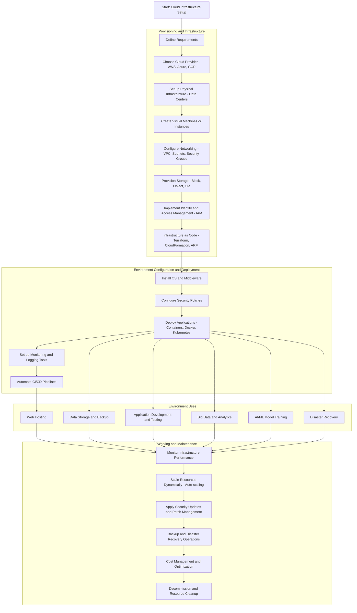

# RAGAs-For-LLM-evaluation

## Overview
This repository provides a production-grade implementation of **Retrieval-Augmented Generation Assessment (RAGAs)** for evaluating LLM logs Google’s **Gemini 2.5 Flash** model and **models/embedding-001**. It computes three core metrics—**faithfulness**, **answer relevancy**, and **context precision**—for each log entry in `logs.json`.

## Repository Structure
```
├── logs.json                       # Input LLM log file
├── ragas_integration.py            # Standalone Python script
├── ragas_integration.ipynb         # Interactive Jupyter notebook
├── requirements.txt                # Python dependencies
├── Output.json                     # Detailed per-sample scores
├── Output_summary_report.json      # Aggregated statistics and summary
└── README.md                       # This file
```

## Setup

1. Clone the repo:  
   ```bash
   git clone https://github.com/your-org/ragas-gemini-integration.git
   cd ragas-gemini-integration
   ```

2. Install dependencies:  
   ```bash
   pip install -r requirements.txt
   ```

3. Set your Google API key (Gemini access):  
   ```bash
   export GOOGLE_API_KEY="YOUR_GOOGLE_API_KEY"
   ```

## Usage

### Python Script
Run end-to-end evaluation on your logs:
```bash
python ragas_integration.py logs.json
```
Results will be written to `Output.json` and `Summary_summary_report.json`.

### Jupyter Notebook
Launch interactive analysis:
```bash
jupyter notebook ragas_integration.ipynb
```
Step through cells to load logs, compute metrics, and view detailed statistics.

## Outputs

- **Output.json**: Array of per-sample metric scores  
- **Output_summary_report.json**: Overall averages, min/max/std, and detailed results  

Sample JSON entry:
```json
{
  "id": "80e8a1e6-6ba2-4b38-9397-56b89564ca00",
  "faithfulness": 1.0000,
  "answer_relevancy": 0.8416,
  "context_precision": 1.0000
}
```

## Metrics Computed

- **Faithfulness**: Factual consistency between response and context  
- **Answer Relevancy**: Alignment of response to user query via embeddings  
- **Context Precision**: Proportion of relevant context chunks  

## Notes

- Implements **async** processing with delay handling for Google API rate limits.  
- Graceful error handling assigns fallback scores of 0.0 on failures.  
- Designed for English-language logs; extendable to other use cases.  

## License
This project is released under the [MIT License](LICENSE).

flowchart TD
    A[Start: Cloud Infrastructure Setup]




